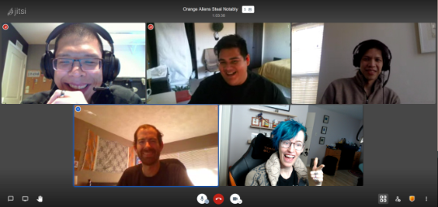
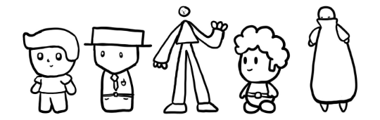
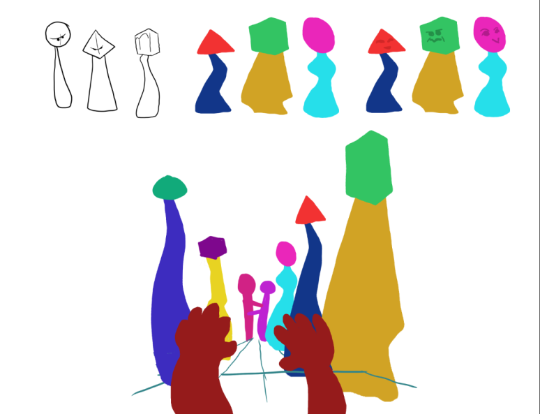
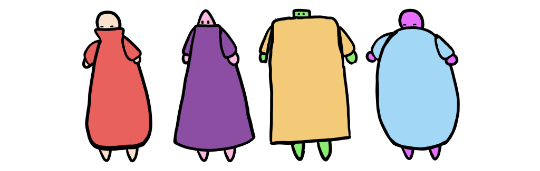
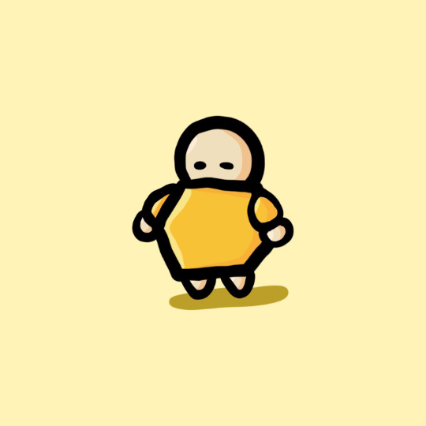
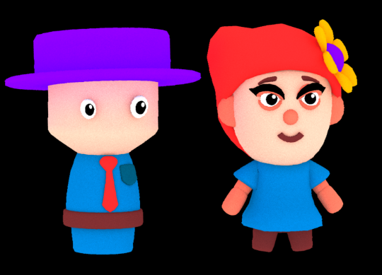
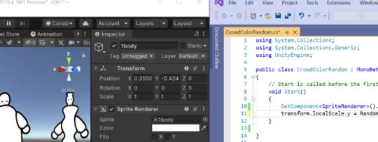
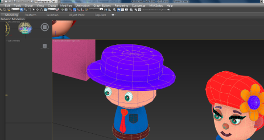
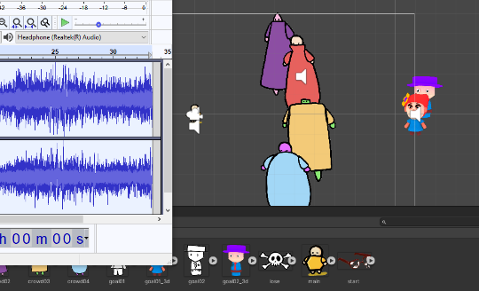

<h2 align="center"></h2>

<h2 align="center"></h2>

<h3 align="center"><em>The experience of losing your parents again</em></h3>

---

<h2 align="center">Global Game Jam 2021: 24-Hour Sprint Edition</h2>

-------------------------------------------------

 <h2 align="center"><b><u>Team Orenji Gaijin</u></b></h2> 

<h2 align="center"></h2>

Software: Robbie [<a href="https://github.com/rclrobertson">@rclrobertson</a>]

2D Art: Lee [<a href="https://github.com/Companionsheep">@Companionsheep</a>]

3D Art: Mondul [<a href="https://github.com/usermkao">@usermkao</a>]

Audio: Atet [<a href="https://github.com/atet">@atet</a>]

Project Manager: ＼(▽￣＼(￣▽￣)／￣▽)／ Haylee [<a href="https://github.com/Sapphomo">@Sapphomo</a>] ＼(▽￣＼(￣▽￣)／￣▽)／

-------------------------------------------------

 <h2 align="center">Concept</h2> 

<blockquote align="center">

 
<a href="https://github.com/Companionsheep">@Companionsheep</a>
</blockquote>
 
<blockquote align="center">

 
<a href="https://github.com/Sapphomo">@Sapphomo</a>
</blockquote>
 
<blockquote align="center">

 
<a href="https://github.com/Companionsheep">@Companionsheep</a>
</blockquote>
 
<blockquote align="center">

 
<a href="https://github.com/usermkao">@usermkao</a>
</blockquote>
 
<blockquote align="center">

 
<a href="https://github.com/atet">@atet</a>
</blockquote>

-------------------------------------------------

 <h2 align="center">Development</h2> 

<h3 align="center"><b>Unity 2019.4.18f1 (LTS) & C#</b></h3> 

<blockquote align="center">

 
<b><em>Squishy bois</em></b> [<a href="https://github.com/Sapphomo">@Sapphomo</a>]
</blockquote>
 
<blockquote align="center">

 
<b><em>Murder fog</em></b> [<a href="https://github.com/rclrobertson">@rclrobertson</a>]
</blockquote>
 
<blockquote align="center">

 
<b><em>Their eyes...</em></b> [<a href="https://github.com/usermkao">@usermkao</a>]
</blockquote>
 
<blockquote align="center">

 
<b><em>MOAR LOUD!!!</em></b> [<a href="https://github.com/atet">@atet</a>]
</blockquote>

-------------------------------------------------

## GitHub

* This is the basic workflow:

1. `clone` (**you only do this once at the beginning**): You copy all the project files from the Github repository onto your computer
2. **DO WORK**: Make your changes (add files, modify stuff, etc.) to the project
3. `pull`: **Before you contribute your changes**, you must grab any changes others have made
4. `add`: Stage your modified files to your list of changes
5. `commit`: Add a message about the changes you made
6. `push`: Send all your changes back to the main repository for everyone to see
7. **Go back to #2** and start over the cycle