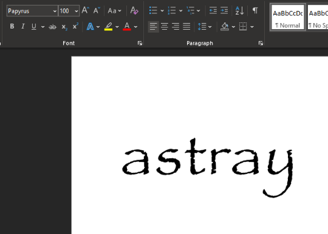
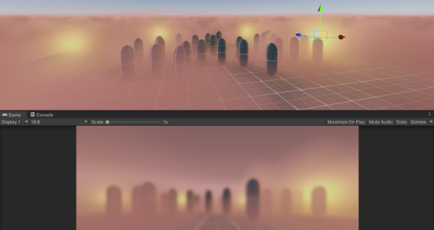

## Global Game Jam 24-Hour Sprint

_The experience of losing your parents over again_

-------------------------------------------------

## Team Orange Aliens

* Software: Robbie [[@rclrobertson](https://github.com/rclrobertson)]
* 2D Art: Lee [[@Companionsheep](https://github.com/Companionsheep)]
* 3D Art: Mondul [[@usermkao](https://github.com/usermkao)]
* Audio: Atet [[@atet](https://github.com/atet)]
* Project Manager: ＼(▽￣＼(￣▽￣)／￣▽)／ Haylee [[@Sapphomo](https://github.com/Sapphomo)] ＼(▽￣＼(￣▽￣)／￣▽)／

-------------------------------------------------

## Concept

> 
> 
> [[@Companionsheep](https://github.com/Companionsheep)]

> 
> 
> [[@Sapphomo](https://github.com/Sapphomo)]

> 
> 
> [[@Companionsheep](https://github.com/Companionsheep)]

> 
> 
> [[@usermkao](https://github.com/usermkao)]

> 
> 
> [[@atet](https://github.com/atet)]

-------------------------------------------------

## Development

### Unity 2019.4.18f1 (LTS) & C#

> 
> 
> **_Squishy bois_** [[@Sapphomo](https://github.com/Sapphomo)]

> 
> 
> **_Murder fog_** [[@rclrobertson](https://github.com/rclrobertson)]

> 
> 
> **_Their eyes..._** [[@usermkao](https://github.com/usermkao)]

> 
> 
> **_MOAR LOUD!!!_** [[@atet](https://github.com/atet)]

-------------------------------------------------

## GitHub

* This is the basic workflow:

1. `clone` (**you only do this once at the beginning**): You copy all the project files from the Github repository onto your computer
2. **DO WORK**: Make your changes (add files, modify stuff, etc.) to the project
3. `pull`: **Before you contribute your changes**, you must grab any changes others have made
4. `add`: Stage your modified files to your list of changes
5. `commit`: Add a message about the changes you made
6. `push`: Send all your changes back to the main repository for everyone to see
7. **Go back to #2** and start over the cycle